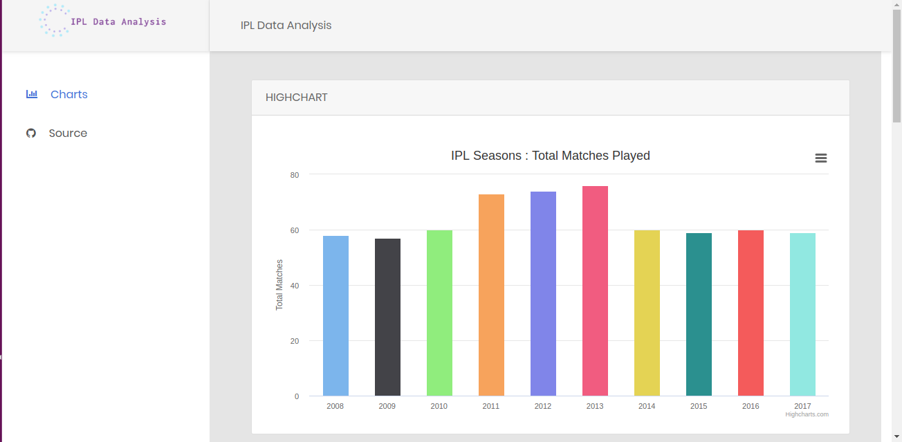
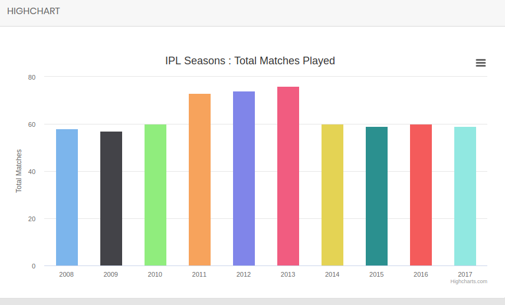
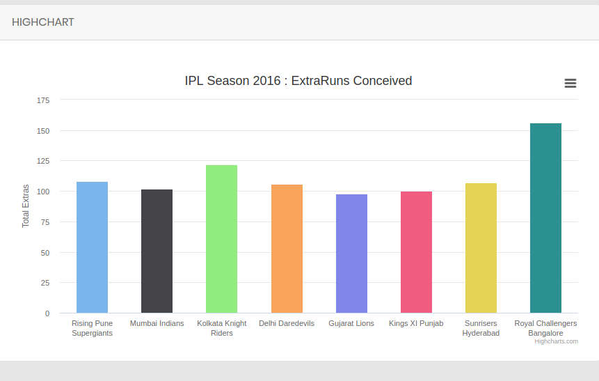
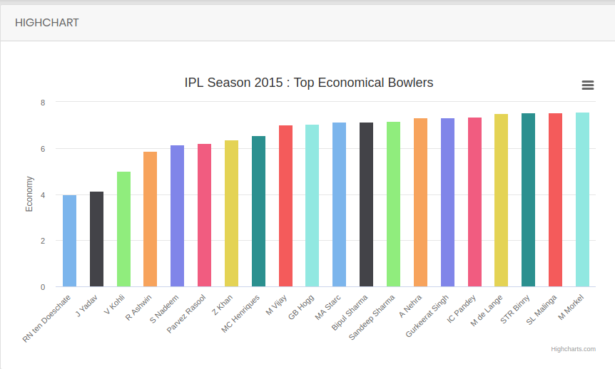
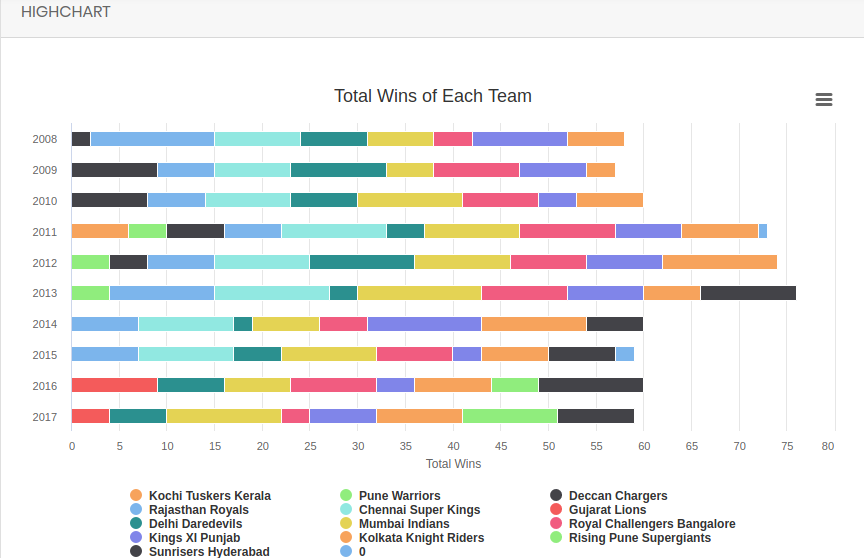

# IPL Project

We transform raw data from IPL into graphs that will convey some meaning / analysis.

## Tools and Framework

This web project was built with HTML5, CSS, Bootstrap, Nodejs, Javascript.

## Node packages required for this Project
1. `convert-csv-to-json`
2. `http-server`

## Instruction to setup the repository
1. clone the repository using `git clone https://github.com/avi1245/FSND_item_catalog.git`
2. Download and install Node and npm.
3. open the terminal, navigate to the repository and run `npm install` which will install all the package required for this project.
4. Then run `http-server`
5. Access it by visiting http://127.0.0.1:8080/ or http://localhost:8080/ locally on the browser.

## Description
### Screenshot

### Question 1:

### Question 2:

### Question 3:

###Question 4:

## Future Improvement

-Make a website responsive for all devices.
-Add more analysis of Data.
